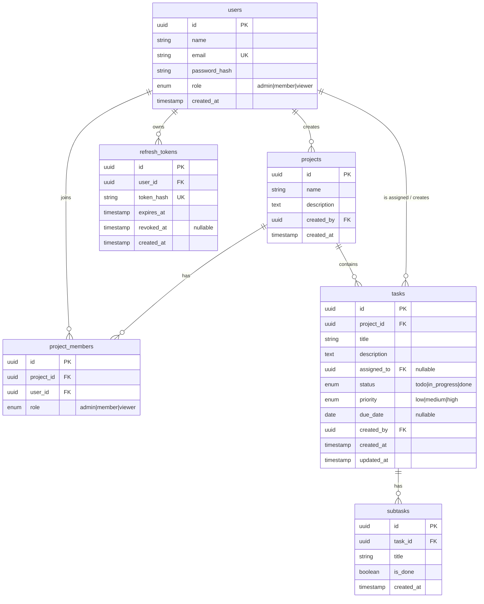

# MiniFlow — Architecture

MiniFlow is a lightweight project-management app (an Asana/Trello-style tool):
users create projects, invite teammates with roles, and manage tasks on a
Kanban board. This document explains the stack, the auth and authorization
design, the data model, and the engineering tradeoffs behind them.

---

## 1. Stack & layout

| Layer    | Choice                                                        |
| -------- | ------------------------------------------------------------- |
| Frontend | Next.js 16 (App Router, TypeScript), Tailwind CSS v4          |
| Backend  | FastAPI (Python 3.12), SQLAlchemy 2.0 (typed), Alembic        |
| Database | PostgreSQL 16                                                 |
| Auth     | Hand-built JWT (access + refresh), bcrypt password hashing    |
| AI       | OpenRouter (OpenAI-compatible) for subtask generation         |
| Tooling  | `uv` (Python), `pnpm` (JS), `ruff`, `pytest`, `vitest`        |

The repo is a monorepo with two deployable apps:

```
asana_clone/
├─ api/                  FastAPI backend
│  ├─ app/
│  │  ├─ core/           config, db session, security, rate limiter
│  │  ├─ models/         SQLAlchemy ORM models
│  │  ├─ schemas/        Pydantic request/response models
│  │  ├─ api/            routers (auth, projects, tasks + subtasks)
│  │  ├─ services/       business logic (auth, project, task, subtask, ai)
│  │  └─ deps/           auth + RBAC FastAPI dependencies
│  ├─ alembic/           migrations
│  └─ tests/             pytest suite
└─ web/                  Next.js frontend
   └─ src/{app,components,lib,hooks}/
```

**Why a separate backend** instead of Next.js API routes: it makes the
backend architecture, the data model, and the authorization layer explicit and
independently testable. The tradeoff is two deploy targets instead of one.

### Request flow

```
Browser ──HTTP──> Next.js (web)
                     │  fetch() via lib/api.ts (typed client)
                     ▼
                  FastAPI (api)
                     │  Pydantic validation → RBAC dependency → service layer
                     ▼
                  PostgreSQL (SQLAlchemy ORM)
```

Routers stay thin: they validate input, run an auth/RBAC dependency, then
delegate to a service function. Services own all persistence and query logic,
which keeps business rules in one place and easy to unit-test.

---

## 2. Authentication

Auth is hand-built rather than delegated to a library, because it is the part
of the system most worth demonstrating explicitly.

- **Passwords** are hashed with bcrypt (via `passlib`); the plaintext is never
  stored or logged.
- **Access tokens** are short-lived JWTs (~15 min), signed with `SECRET_KEY`
  (HS256) and carrying the user id. The `get_current_user` dependency parses
  the `Authorization: Bearer` header, verifies the signature and expiry, and
  loads the user.
- **Refresh tokens** are long-lived (~7 days). Only a SHA-256 **hash** of each
  refresh token is stored, in the `refresh_tokens` table. This means:
  - logout can truly revoke a session (set `revoked_at`);
  - refresh **rotates** the token — using one issues a new pair and revokes
    the old, so a stolen-and-reused token is detectable/limited.
- **Login responses are deliberately vague** ("Invalid email or password") so
  they don't reveal whether an email is registered.

The frontend keeps the token pair in memory + storage and **auto-refreshes on
a 401**: `requestWithRefresh` retries the original request once with a fresh
access token before surfacing the error.

### Rate limiting

`/login` and `/signup` are rate-limited per client IP (slowapi, default
`10/minute`) to blunt credential stuffing and signup abuse. The limit is
configurable via `AUTH_RATE_LIMIT` and disabled in the test suite.

---

## 3. Authorization (RBAC)

**Per-project roles are authoritative.** The schema defines a role on *both*
`users` and `project_members`. `users.role` is kept as the account's default
role but is **never** used for project authorization. Every project-scoped
permission is decided by the caller's `project_members.role`:

| Role       | Permissions                                                       |
| ---------- | ----------------------------------------------------------------- |
| **Admin**  | Manage members & roles, edit/delete any task, edit/delete project |
| **Member** | Create tasks/subtasks, edit/delete tasks they created or are assigned, comment |
| **Viewer** | Read-only                                                         |

Why per-project roles: the permission matrix mixes global actions ("create a
project") with project-scoped ones ("change roles"). A single global role
cannot express "Admin of project A, Viewer of project B". Per-project roles is
the only internally consistent model. Any authenticated user may create a
project and becomes its Admin.

Enforcement lives in **backend dependencies**, not frontend hiding:

- `get_current_user` — authenticates the request.
- `get_project_membership` — resolves the caller's role for a project;
  `404` if the project is missing, `403` if the caller is not a member.
- `require_project_role(*roles)` — admits only the given project roles.
- Pure helpers in `services/permissions.py` (`can_create_task`,
  `can_modify_task`, …) encode object-level rules, e.g. a Member may modify
  only tasks they created or are assigned to.

The frontend mirrors these rules in `lib/permissions.ts` purely to decide what
UI to *offer* — every rule is independently re-checked server-side, so a
forced request still fails with `403`.

---

## 4. Data model



Notes:

- `project_members` has a `UNIQUE(project_id, user_id)` constraint — a user is
  a member of a project at most once.
- **Cascades:** deleting a project removes its `project_members` and `tasks`;
  deleting a task removes its `subtasks`. A deleted user's authored tasks
  cascade; their *assignment* is `SET NULL` so the task survives.
- All schema changes are versioned with Alembic migrations
  (`api/alembic/versions/`); there is no `create_all` in production paths.

---

## 5. AI feature — Generate Subtasks

A task can be broken into a checklist by AI. `POST /tasks/{id}/subtasks/generate`
sends the task title and description to an LLM and asks for a JSON array of
short subtask titles.

Design choices:

- **Provider-agnostic:** any OpenAI-compatible endpoint works; the default is
  OpenRouter with a free model (`openai/gpt-oss-120b:free`). Configured purely
  by environment variables (`LLM_*`).
- **Strict parsing:** the model reply is parsed defensively — markdown fences
  and surrounding prose are tolerated, the first JSON array is extracted,
  non-string and blank items are dropped, and the list is capped at 10.
- **Graceful failure** with typed exceptions mapped to clean HTTP statuses —
  no key → `503`, upstream/network error → `502`, unparseable reply → `422`.
  The UI shows a friendly message and stays usable.
- **Human in the loop:** `/generate` does **not** persist anything. It returns
  suggestions; the user reviews, edits, and chooses which to save as real
  subtasks.

---

## 6. Frontend

- **App Router** with two route groups: `(auth)` for login/signup and `(app)`
  for authenticated screens, guarded by an `AuthGuard` that redirects logged-out
  users to `/login`.
- A small **design system** in `components/ui/` (Button, Modal, Input, Badge,
  Toast, …) over Tailwind v4 design tokens defined in `globals.css`.
- `useResource(loader, deps)` standardises loading / error / retry state for
  every data fetch.
- **Bonus features:** drag-and-drop task cards between Kanban columns
  (`@dnd-kit`), and a persisted **dark mode** (`data-theme` on `<html>`, with a
  no-flash inline script that restores the choice before first paint).

---

## 7. Tradeoffs & known limitations

- **Two deploy targets** (web + api) instead of one — accepted, for a clean
  front/back separation.
- **Subtasks are a flat checklist**, not recursive tasks — simpler and matches
  the "AI task breakdown" use case.
- **Rate-limit storage is in-process** (slowapi memory backend) — fine for a
  single instance; a multi-instance deployment would need a shared store
  (e.g. Redis).
- Comments and an activity log are scoped in the plan but not implemented;
  the data model leaves room for them.
